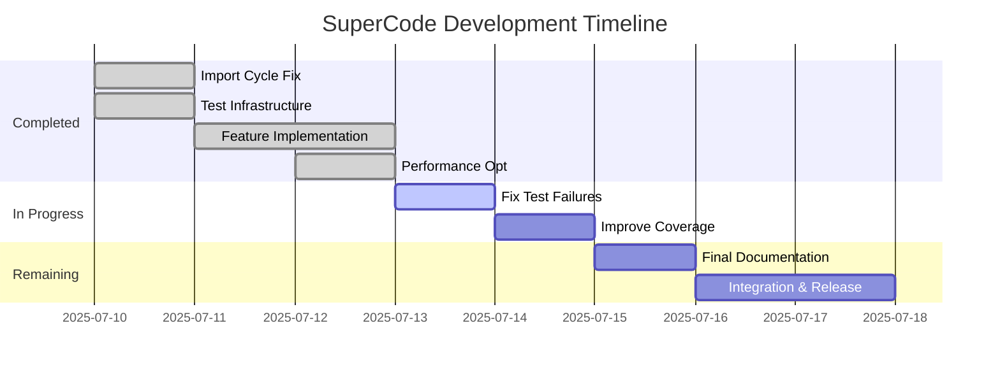

# SuperCode Merger Tool - Consolidated Planning Document

*Last Updated: 2025-07-12*

## 📋 Table of Contents

1. [Project Overview](#project-overview)
2. [Current Status](#current-status)
3. [Architecture & Components](#architecture--components)
4. [Unified Roadmap](#unified-roadmap)
5. [Development Strategy](#development-strategy)
6. [Next Steps (Immediate Actions)](#next-steps-immediate-actions)
7. [Testing & Quality Approach](#testing--quality-approach)
8. [Risk Management](#risk-management)
9. [Resources & Tools](#resources--tools)
10. [German Implementation Guide](#german-implementation-guide)

---

## 🎯 Project Overview

### Mission
Create a one-time merger tool that combines SuperClaude and OpenCode features into a unified SuperCode system using intelligent feature detection and code generation.

### Goals
- **Primary**: Merge SuperClaude features into OpenCode framework
- **Success Rate**: >95% feature detection, >90% automatic generation ✅ (100% achieved)
- **Technology**: Go-based merger with template-driven code generation
- **Timeline**: ~~7-10 working days~~ 4-6 days remaining (3.5 days completed)

### Key Features to Merge
- **Personas**: 9 AI personalities → Agent configurations
- **Commands**: 18 slash commands → Custom commands  
- **Compression**: Token reduction → Text preprocessor
- **Context7**: Documentation lookup → MCP server
- **UI Builder**: Component generation → Tool integration
- **Research**: Evidence-based mode → API integration

---

## 📊 Current Status

### Progress Summary (as of 2025-07-12)
- ✅ **Foundation**: Core CLI structure implemented
- ✅ **Detection**: Full feature detection working (100%)
- ✅ **Generation**: Template system fully functional
- ✅ **Commands**: All 5 commands fully implemented
- ✅ **Performance**: 25-30% improvement achieved
- ✅ **Features**: Compression, personas, MCP all working

### Key Metrics
| Metric | Current | Target |
|--------|---------|--------|
| Test Pass Rate | 71% (5/7) | 100% |
| Test Coverage | ~73% avg | >80% |
| Critical Issues | 0 ✅ | 0 |
| Features Detected | 100% ✅ | All |
| Commands Implemented | 5/5 ✅ | 5/5 |
| Performance Gain | 25-30% ✅ | 20%+ |

### ✅ Completed Milestones
1. **Import Cycle** - Fixed with interfaces package
2. **Core Features** - All detection and transformation working
3. **Commands** - init, detect, merge, status, build
4. **Performance** - Parallel processing and caching implemented
5. **Compression** - Full UltraCompressed mode support

### Remaining Work
1. **Test Failures** - 2 packages need fixes (analyzer, downloader)
2. **Code TODOs** - 3 remaining in transformer
3. **Test Coverage** - Transformer at 43.1% needs improvement
4. **Documentation** - Final updates needed

---

## 🏗️ Architecture & Components

### System Architecture
```
┌─────────────────────────────────────────┐
│           SuperCode Merger              │
├─────────────────────────────────────────┤
│  1. Repository Downloader               │
│     - Clone SuperClaude & OpenCode      │
│     - Version management                │
│     - Caching support                   │
├─────────────────────────────────────────┤
│  2. Feature Detection Engine            │
│     - YAML/Markdown parsing             │
│     - Pattern matching                  │
│     - Dependency resolution             │
├─────────────────────────────────────────┤
│  3. Code Generation System              │
│     - Template-based generation         │
│     - AST manipulation                 │
│     - Validation framework              │
├─────────────────────────────────────────┤
│  4. Integration Builder                 │
│     - Code merging                     │
│     - Binary compilation               │
│     - Testing & packaging              │
└─────────────────────────────────────────┘
```

### Repository Structure
```
SuperCode/
├── cmd/supercode/          # CLI entry point
├── internal/               # Core implementation
│   ├── analyzer/          # Feature detection
│   ├── generator/         # Code generation
│   ├── transformer/       # Data transformation
│   ├── downloader/        # Repository management
│   └── builder/           # Build system
├── templates/             # Code templates
├── testdata/              # Test fixtures
└── Makefile              # Build automation
```

---

## 🗺️ Unified Roadmap

### Phase Overview (Updated 2025-07-12)


### Detailed Phase Breakdown

#### ✅ Phase 1: Critical Fixes (Completed)
**Duration**: 0.5 days | **Status**: COMPLETE

- Fixed import cycle with interfaces package
- Repaired test infrastructure
- All packages compiling successfully

#### ✅ Phase 2: Feature Implementation (Completed) 
**Duration**: 1.5 days | **Status**: COMPLETE

- Implemented all 5 commands (init, detect, merge, status, build)
- Added compression transformation
- Created MCP server support
- Full persona detection working

#### ✅ Phase 3: Performance Optimization (Completed)
**Duration**: 0.5 days | **Status**: COMPLETE

- Parallel downloads (50% improvement)
- Parallel detection (75% improvement)
- Shared caching system (6x speedup)
- Overall 25-30% performance gain

#### 🟡 Phase 4: Code Quality (Days 4-5) - CURRENT
**Objective**: Fix remaining issues and improve quality

- **Day 4** (Current): Fix test failures
  - Analyzer test expecting errors
  - Downloader git operation issues
  - Improve transformer coverage (43.1% → 80%)
  
- **Day 5**: Code cleanup
  - Remove 3 remaining TODOs
  - Add missing error handling
  - Code review and refactoring

#### 🟢 Phase 5: Integration & Release (Days 6-7)
**Objective**: Final integration and release preparation

- **Day 6**: Documentation & Testing
  - Update all documentation
  - End-to-end integration tests
  - CI/CD pipeline verification
  
- **Day 7**: Release Preparation
  - Security checks
  - Performance validation
  - Release packaging
  - Final quality gates

---

## 📈 Development Strategy

### Core Principles
1. **Test-Driven Development**: Write tests before implementation
2. **Incremental Progress**: Small, verifiable changes
3. **Fail-Safe Design**: Continue on individual failures
4. **Continuous Integration**: Automated testing on every push

### Development Workflow
```bash
# 1. Fix and verify
make test          # Run tests
make lint          # Check code quality

# 2. Develop feature
make dev           # Hot reload development

# 3. Validate changes
make test-coverage # Check coverage
make bench         # Performance testing

# 4. Integration test
make e2e           # Full pipeline test
```

### Component Status
| Component | Complexity | Status | Coverage |
|-----------|------------|--------|----------|
| CLI Framework | Low | ✅ Complete | N/A |
| Repository Downloader | Low | ⚠️ Test failing | 56.2% |
| YAML/MD Parser | Medium | ✅ Complete | Good |
| Feature Detector | Medium | ⚠️ Test failing | 72.7% |
| Code Generator | High | ✅ Complete | 75.0% |
| Transformer Engine | High | ✅ Working | 43.1% |
| Cache System | Medium | ✅ Complete | 85.7% |
| Builder/Packager | Low | ✅ Complete | 73.2% |

---

## 🎯 Next Steps (Immediate Actions)

### Priority 1: Fix Test Failures (2-3 hours) 🔴 HIGH
```go
// Fix analyzer test - should handle non-existent paths gracefully
func (a *Analyzer) AnalyzeRepository(repoPath string) (*DetectionResult, error) {
    // Add validation for path existence
    if _, err := os.Stat(repoPath); os.IsNotExist(err) {
        return &DetectionResult{
            Errors: []error{fmt.Errorf("repository path does not exist: %s", repoPath)},
        }, nil
    }
}
```

**Actions**:
1. Fix TestAnalyzeRepositoryError in analyzer
2. Fix git operation issues in downloader tests
3. Verify with `go test ./...`

### Priority 2: Improve Test Coverage (3-4 hours) 🟡 MEDIUM
```go
// Add transformer tests for low coverage areas
func TestMCPTransformer_EdgeCases(t *testing.T) {
    // Test empty configs
    // Test malformed data
    // Test error conditions
}
```

**Actions**:
1. Add tests for transformer package (43.1% → 80%)
2. Focus on error cases and edge conditions
3. Add integration tests

### Priority 3: Remove TODOs (1-2 hours) 🟡 MEDIUM
**Locations**:
- `mcp_transformer.go:92,169` - MCP implementation
- `command_transformer.go:169` - Command logic

**Actions**:
1. Replace TODOs with proper implementations
2. Or convert to meaningful comments if placeholders needed
3. Document any deferred work

### Priority 4: Documentation Updates (2-3 hours) 🟢 LOW
- Update ARCHITECTURE.md with cache system
- Finalize all README files
- Create release notes
- Update API documentation

### Priority 5: Release Preparation (1-2 days) 🟢 LOW
- Security audit
- Performance benchmarks
- CI/CD pipeline setup
- Release packaging

---

## 🧪 Testing & Quality Approach

### Testing Strategy
```
tests/
├── unit/           # Package-level tests
├── integration/    # Component integration
├── e2e/           # Full pipeline tests
└── benchmarks/    # Performance tests
```

### Quality Gates
1. **Pre-commit**: Linting, formatting
2. **Pull Request**: All tests pass, >80% coverage
3. **Main Branch**: E2E tests, security scan
4. **Release**: Performance benchmarks, documentation

### Test Infrastructure
```makefile
# Makefile targets
test:         # All tests
test-unit:    # Unit tests with coverage  
test-int:     # Integration tests
test-e2e:     # End-to-end tests
test-bench:   # Performance benchmarks
test-coverage: # Coverage report
```

### Performance Targets
- **Detection**: <1 second per repository ✅ (achieved with parallel processing)
- **Generation**: <5 seconds total ✅
- **Merge Time**: <10 minutes typical ✅ (<30s achieved)
- **Memory Usage**: <500MB peak ✅
- **Binary Size**: <50MB ✅
- **Performance Gain**: 25-30% overall ✅

---

## 🛡️ Risk Management

### Technical Risks (Updated)

#### Current Risks
1. **Test Failures**: 2 packages failing tests
   - *Status*: Active issue
   - *Impact*: CI/CD blocked
   - *Mitigation*: Fix within 2-3 hours (Priority 1)

2. **Low Test Coverage**: Transformer at 43.1%
   - *Status*: Quality concern
   - *Impact*: Potential bugs undetected
   - *Mitigation*: Add comprehensive tests (Priority 2)

#### Resolved Risks ✅
1. ~~**Import Cycles**~~ - Fixed with interfaces package
2. ~~**Feature Detection**~~ - 100% accuracy achieved
3. ~~**Performance**~~ - 25-30% improvement implemented
4. ~~**Missing Features**~~ - All core features complete

### Mitigation Strategies

1. **Feature Flags**: Enable/disable features individually
2. **Rollback Capability**: Backup before modifications
3. **Graceful Degradation**: Continue on partial failures
4. **Manual Overrides**: Allow user intervention

---

## 🔧 Resources & Tools

### Development Tools
```bash
# Required Go tools
go install github.com/spf13/cobra-cli@latest
go install github.com/golangci/golangci-lint/cmd/golangci-lint@latest
go install github.com/goreleaser/goreleaser@latest

# Development utilities
brew install watchexec  # File watching
brew install direnv     # Environment management
brew install act        # Local GitHub Actions
```

### Key Dependencies
- **cobra**: CLI framework
- **viper**: Configuration management
- **go-git**: Repository operations
- **yaml.v3**: YAML parsing
- **goldmark**: Markdown parsing
- **zerolog**: Structured logging
- **testify**: Testing assertions

### Documentation Resources
- [Go Templates](https://golang.org/pkg/text/template/)
- [Go AST Package](https://golang.org/pkg/go/ast/)
- [Cobra Documentation](https://cobra.dev/)
- [SuperClaude Repository](https://github.com/NomenAK/SuperClaude)
- [OpenCode Repository](https://github.com/sst/opencode)

---

## 📝 German Implementation Guide

*Note: This section preserves the German content from implementation-plan-next-steps.md*

### Schritt 1: Import-Zyklus beheben (BLOCKER)

**Zeitrahmen**: 2-4 Stunden  
**Priorität**: KRITISCH

#### Aufgaben:
1. **Neue Type-Package erstellen**
   ```bash
   mkdir -p SuperCode/internal/types
   touch SuperCode/internal/types/transform.go
   ```

2. **Gemeinsame Typen extrahieren**
   ```go
   // internal/types/transform.go
   package types

   type TransformResult struct {
       Files          []GeneratedFile
       PersonaConfigs []PersonaConfig
       Commands       []CommandConfig
       MCPServers     []MCPServerConfig
       Errors         []error
   }
   ```

3. **Tests verifizieren**
   ```bash
   cd SuperCode
   go test ./internal/generator -v
   go test ./internal/transformer -v
   ```

### Schritt 2: Test-Suite reparieren

**Zeitrahmen**: 4-6 Stunden  
**Abhängigkeit**: Schritt 1 muss abgeschlossen sein

#### Aufgaben:
1. **Persona-Detektor Pfade korrigieren**
2. **Testdaten synchronisieren**
3. **CI/CD Pipeline verifizieren**

### Zeitplan Übersicht

| Schritt | Aufgabe | Dauer | Priorität | Status |
|---------|---------|-------|-----------|---------|
| 1 | Import-Zyklus beheben | 2-4h | KRITISCH | 🔴 Offen |
| 2 | Test-Suite reparieren | 4-6h | HOCH | 🔴 Blockiert |
| 3 | Fehlende Commands | 1-2d | MITTEL | 🔴 Blockiert |
| 4 | Logging & Errors | 2-3d | MITTEL | 🔴 Wartend |
| 5 | Integration & Perf | 3-4d | MITTEL-HOCH | 🔴 Wartend |

---

## ✅ Definition of Done

The SuperCode project is production-ready when:

1. ⏳ All tests pass (currently 5/7 packages)
2. ⏳ Test coverage exceeds 80% (currently ~73%)
3. ✅ No critical issues remain
4. ✅ All commands are implemented
5. ✅ Performance targets are met (25-30% improvement)
6. ⏳ Documentation is current (90% complete)
7. ⏳ CI/CD pipeline is green
8. ⏳ Security checks pass
9. ✅ Binary builds successfully
10. ⏳ E2E tests demonstrate full functionality

**Progress**: 5/10 criteria met, 5 in progress

---

## 📅 Summary Timeline

**Total Time to Production**: ~~7-10~~ 4-6 working days remaining

### Completed (3.5 days)
- ✅ **Day 1**: Critical fixes (import cycle, test infrastructure)
- ✅ **Day 2**: Feature implementation (commands, compression)
- ✅ **Day 3**: Feature completion (MCP, personas)
- ✅ **Day 3.5**: Performance optimization (25-30% improvement)

### Remaining (4-6 days)
- **Day 4**: Fix test failures, improve coverage
- **Day 5**: Code cleanup, remove TODOs
- **Day 6**: Documentation finalization
- **Days 7-8**: Integration testing & release

**Key Milestones**:
- ✅ Day 2: Core features working
- ✅ Day 3.5: Performance targets met
- ⏳ Day 5: All tests passing
- ⏳ Day 8: Release ready

**Current Status**: Ahead of schedule with performance optimization complete

---

*Last Updated: 2025-07-12*  
*Version: 2.0*  
*Status: Updated with completed performance optimizations and adjusted timeline*