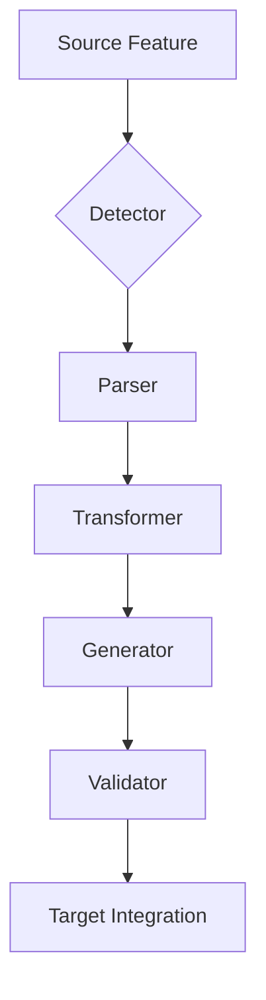

# Feature Mapping Guide

## Introduction

Feature mapping is the process of identifying features in one system and transforming them to work within another system's architecture. This guide provides comprehensive patterns, rules, and examples for successful feature transformation during system mergers, migrations, or integrations.

## Table of Contents
1. [Transformation Pipeline](#transformation-pipeline)
2. [Feature Detection](#feature-detection)
3. [Mapping Categories](#mapping-categories)
4. [Implementation Patterns](#implementation-patterns)
5. [Validation & Testing](#validation--testing)
6. [Migration Strategy](#migration-strategy)

---

## Transformation Pipeline

The feature transformation process follows a structured pipeline:



### Pipeline Stages

1. **Detection**: Identify features in source codebase
2. **Parsing**: Extract feature configuration and behavior
3. **Transformation**: Convert to target system format
4. **Generation**: Create target implementation code
5. **Validation**: Verify correctness and completeness
6. **Integration**: Merge into target system

---

## Feature Detection

### Detection Patterns

Feature detection uses multiple strategies to identify transformable elements:

#### File-Based Detection
```yaml
detection:
  files:
    - "config/*.yml"
    - "features/**/*.json"
    - "*.config.js"
    - "personas/*.yml"
    - "shared/*.yml"
    - "*.md" # for directive-based configurations
  patterns:
    - regex: "feature:\s*(\w+)"
    - yaml_key: "features.*"
    - json_path: "$.features[*]"
    - regex: "persona:\s*(\w+)"
    - yaml_key: "personas.*"
```

#### Content Pattern Detection
```go
// Pattern-based feature detector
func DetectFeatures(dir string) ([]Feature, error) {
    patterns := map[string]*regexp.Regexp{
        "command": regexp.MustCompile(`/user:(\w+)`),
        "config": regexp.MustCompile(`@include\s+([^\s]+)`),
        "api": regexp.MustCompile(`api\.(\w+)\(`),
        "persona": regexp.MustCompile(`persona:\s*(\w+)`),
    }
    
    var features []Feature
    filepath.Walk(dir, func(path string, info os.FileInfo, err error) error {
        content, _ := ioutil.ReadFile(path)
        for fType, pattern := range patterns {
            matches := pattern.FindAllStringSubmatch(string(content), -1)
            for _, match := range matches {
                features = append(features, Feature{
                    Type: fType,
                    Name: match[1],
                    File: path,
                })
            }
        }
        return nil
    })
    return features, nil
}
```

#### Configuration-Based Detection
```yaml
detection:
  config_files:
    - "manifest.json"
    - "package.json"
    - ".config/features.yml"
    - "config.json"
  keys:
    - "features"
    - "plugins"
    - "extensions"
    - "modules"
```

---

## Mapping Categories

### 1. Agent/Persona Systems

Transform AI personalities or agent configurations between systems.

#### Source Structure Example
```yaml
personas:
  architect:
    systemPrompt: "You are a system architect..."
    model: "claude-3-opus"
    temperature: 0.7
    tools: ["sequential", "research", "diagram"]
  frontend:
    systemPrompt: "You are a frontend developer..."
    model: "claude-3-sonnet"
    temperature: 0.8
    tools: ["magic", "browser", "figma"]
```

#### Target Implementation Pattern

##### Provider-Based Persona System
```typescript
// Provider-based implementation
export class PersonaProvider extends BaseProvider {
  personas = {
    architect: {
      systemPrompt: loadYaml('architect.yml'),
      model: 'claude-3-opus-20240229',
      temperature: 0.7,
      tools: ['sequential', 'research', 'diagram']
    },
    frontend: {
      systemPrompt: loadYaml('frontend.yml'),
      model: 'claude-3-sonnet-20240229',
      temperature: 0.8,
      tools: ['magic', 'browser', 'figma']
    }
    // ... other personas
  }
  
  activatePersona(name: string) {
    const persona = this.personas[name];
    this.setSystemPrompt(persona.systemPrompt);
    this.setModel(persona.model);
    this.setTools(persona.tools);
  }
}
```

##### Configuration Integration
```json
// Configuration file integration
{
  "provider": {
    "type": "personas",
    "defaultPersona": "architect",
    "autoActivation": {
      "*.architecture.md": "architect",
      "*.tsx": "frontend",
      "*.security.md": "security"
    }
  }
}
```

#### Transformation Rules
```yaml
persona_mapping:
  models:
    "claude-3-opus": "claude-3-opus-20240229"
    "claude-3-sonnet": "claude-3-sonnet-20240229"
    "gpt-4": "gpt-4-turbo-preview"
  
  prompt_transform:
    prefix: "As a {{persona_type}} agent"
    suffix: "Use available tools effectively"
  
  tool_mapping:
    "sequential": "sequential_analysis"
    "research": "documentation_search"
    "magic": "ui_builder"
    "browser": "web_automation"
```

#### Generated Code Example
```go
// Generated agent implementation
package agents

type ArchitectAgent struct {
    *BaseAgent
}

func NewArchitectAgent() *ArchitectAgent {
    return &ArchitectAgent{
        BaseAgent: &BaseAgent{
            Name:         "architect",
            SystemPrompt: architectPrompt,
            Model:        "claude-3-opus-20240229",
            Temperature:  0.7,
            Tools:        []string{"sequential", "research", "diagram"},
        },
    }
}
```

### 2. Command Systems

Map command-line interfaces, slash commands, or action triggers.

#### Command Categories Example
- **Development**: build, setup, test, spawn
- **Code Quality**: review, analyze, improve, refactor
- **Operations**: deploy, migrate, troubleshoot, cleanup
- **Documentation**: explain, document
- **Planning**: design, estimate
- **Security**: scan, audit
- **Version Control**: git, merge
- **Context**: load, task

#### Detection Pattern
```yaml
command_detection:
  files:
    - "commands/**/*.md"
    - "shared/commands/*.yml"
    - "*.command.js"
  patterns:
    - regex: "/(cmd|command|action|user):(\w+)"
    - frontmatter: "command: true"
    - decorator: "@command\\(.*\\)"
```

#### Target Implementation Pattern

##### Command Registration
```typescript
// Command definition pattern
import { defineCommand } from '../command';

export default defineCommand({
  name: 'build',
  aliases: ['construct', 'make'],
  description: 'Build orchestration command',
  
  flags: {
    framework: {
      type: 'string',
      choices: ['react', 'vue', 'angular', 'next', 'nuxt']
    },
    typescript: {
      type: 'boolean',
      default: true
    },
    ...inheritUniversalFlags()
  },
  
  async execute(args, flags) {
    // Command logic implementation
    await executeBuildWorkflow(args, flags);
  }
});
```

#### Command Mapping Pattern

| Source Pattern | Target Pattern | Implementation |
|---------------|----------------|----------------|
| `/command` | `cli command` | Direct command mapping |
| `/user:action` | `cli action` | User action command |
| `@command` | Built-in feature | Feature integration |

#### Command Template
```markdown
---
name: command-name
aliases: ["alias1", "alias2"]
category: category-name
flags:
  - name: flag-name
    type: string|boolean|number
    description: Flag description
    choices: ["option1", "option2"]
  - name: another-flag
    type: boolean
    default: true
---

# Command Documentation

{{ .Description }}

## Usage
```
cli command-name --flag value
```

## Implementation
{{ .Content | convertSyntax }}
```

### 3. Text Processing & Compression

Transform text compression, minification, or optimization features.

#### Detection Pattern
```yaml
detection:
  files:
    - "compression/*.yml"
    - "config/compression.json"
  sections:
    - "compression_mode"
    - "token_economy"
    - "text_optimization"
```

#### Compression Rules
```go
// Abbreviation dictionary mapping
var compressionRules = map[string]string{
    "implementation": "impl",
    "configuration": "cfg",
    "directory": "dir",
    "function": "fn",
    "variable": "var",
    "parameter": "param",
    "return": "ret",
    "error": "err",
}

// Pattern-based compression
var compressionPatterns = []CompressionPattern{
    {
        Pattern: regexp.MustCompile(`\b(\w+)ing\b`),
        Replace: "${1}g",  // running -> runng
    },
    {
        Pattern: regexp.MustCompile(`\bthe\s+`),
        Replace: "",  // remove articles
    },
    {
        Pattern: regexp.MustCompile(`\s+`),
        Replace: " ",  // normalize whitespace
    },
}
```

#### Compression Targets
```yaml
compression_targets:
  levels:
    normal:
      target_reduction: 0.3
      preserve_readability: true
    ultra:
      target_reduction: 0.7
      aggressive_abbreviation: true
    extreme:
      target_reduction: 0.9
      syntax_only: true
```

### 4. Extension/Plugin Systems

Map extension protocols, plugins, or server implementations.

#### Extension Server Pattern
```yaml
extension_mapping:
  source:
    trigger: "feature detection"
    apis: ["api1", "api2", "api3"]
  
  target:
    server:
      name: "extension-name"
      protocol: "stdio|http|websocket"
      executable: "path/to/extension"
    
    config:
      cache_duration: "24h"
      auto_activate: true
      supported_types: ["type1", "type2"]
```

##### Server Implementation Pattern
```typescript
// Extension server implementation
export class ExtensionServer implements ServerProtocol {
  name = 'extension-name';
  
  async capabilities() {
    return {
      tools: this.getAvailableTools(),
      commands: this.getCommands(),
      events: this.getSupportedEvents()
    };
  }
  
  async executeTool(tool: string, params: any) {
    const handler = this.toolHandlers[tool];
    return handler ? handler(params) : null;
  }
  
  async executeCommand(command: string, args: any) {
    // Command execution logic
  }
}
```

##### Extension Configuration
```json
// Extension configuration
{
  "extensions": {
    "extension1": {
      "type": "local",
      "command": ["cli", "ext", "extension1"],
      "autoActivate": ["*.ext1", "*.ext2"],
      "config": {
        "option1": "value1",
        "option2": true
      }
    },
    "extension2": {
      "type": "remote",
      "url": "http://extension-server:8080",
      "capabilities": ["capability1", "capability2"]
    }
  }
}
```

### 5. Advanced Features

#### Sequential Processing
```yaml
sequential:
  detection:
    keywords: ["analyze", "think", "reason", "process"]
    flags: ["--sequential", "--step-by-step"]
  
  transformation:
    tool_name: "sequential_processor"
    max_steps: 10
    context_preservation: true
    
  implementation:
    file: "processors/sequential.go"
    interface: "Processor"
```

#### UI Component Generation
```yaml
ui_builder:
  detection:
    commands: ["ui", "component", "build-ui"]
    file_patterns: ["*.jsx", "*.vue", "*.component.ts"]
  
  transformation:
    frameworks:
      react: "ReactGenerator"
      vue: "VueGenerator"
      angular: "AngularGenerator"
    
    templates:
      - "button"
      - "form"
      - "card"
      - "layout"
      - "table"
```

#### Component Generation Template
```typescript
// Component generation pattern
const componentTemplate = {
  functional: `
    export const {{Name}} = ({{props}}) => {
      {{hooks}}
      return (
        {{jsx}}
      );
    };
  `,
  
  class: `
    export class {{Name}} extends Component {
      {{state}}
      {{methods}}
      render() {
        return {{jsx}};
      }
    }
  `
};
```

### 6. Flag System Implementation

#### Universal Flags Pattern
```typescript
// Universal flags that apply to all commands
export const universalFlags = {
  // Processing modes
  verbose: {
    type: 'boolean',
    description: 'Enable verbose output'
  },
  quiet: {
    type: 'boolean',
    description: 'Suppress output'
  },
  
  // Feature flags
  compression: {
    type: 'string',
    choices: ['none', 'normal', 'ultra'],
    default: 'none'
  },
  
  // Extension control
  'enable-ext': {
    type: 'array',
    description: 'Enable specific extensions'
  },
  'disable-ext': {
    type: 'array',
    description: 'Disable specific extensions'
  },
  
  // Mode selection
  mode: {
    type: 'string',
    choices: ['development', 'production', 'test'],
    default: 'development'
  }
};

// Mixin pattern for commands
export function withUniversalFlags(commandFlags) {
  return { ...commandFlags, ...universalFlags };
}
```

### 7. Configuration Systems

Transform configuration formats and schemas between systems.

#### Configuration Schema Extension
```typescript
// Extended configuration schema
export const configSchema = z.object({
  // Base configuration
  base: z.object({
    name: z.string(),
    version: z.string(),
    // ... other base config
  }),
  
  // Feature extensions
  features: z.object({
    personas: z.object({
      default: z.string().optional(),
      autoActivation: z.record(z.string()).optional()
    }).optional(),
    
    compression: z.object({
      enabled: z.boolean().default(false),
      level: z.enum(['normal', 'ultra']).default('normal'),
      dictionary: z.string().optional()
    }).optional(),
    
    extensions: z.object({
      enabled: z.array(z.string()).default([]),
      config: z.record(z.any()).optional()
    }).optional(),
    
    tasks: z.object({
      enabled: z.boolean().default(true),
      persistence: z.boolean().default(true)
    }).optional()
  }).optional()
});
```

---

## Implementation Patterns

### Generator Templates

#### Go Template Example
```go
// templates/feature.go.tmpl
package {{.Package}}

type {{.Name | title}}Feature struct {
    *BaseFeature
    {{range .Fields}}
    {{.Name | title}} {{.Type}} `json:"{{.Name | lower}}"`
    {{end}}
}

func New{{.Name | title}}Feature(config Config) *{{.Name | title}}Feature {
    return &{{.Name | title}}Feature{
        BaseFeature: NewBaseFeature(config),
        {{range .Fields}}
        {{.Name | title}}: config.Get{{.Name | title}}(),
        {{end}}
    }
}

{{range .Methods}}
func (f *{{$.Name | title}}Feature) {{.Name}}({{.Params}}) {{.Returns}} {
    {{.Body}}
}
{{end}}
```

#### TypeScript Template Example
```typescript
// templates/feature.ts.tmpl
import { BaseFeature, Config } from '../core';
{{.Imports}}

export class {{.Name}}Feature extends BaseFeature {
  {{#fields}}
  private {{name}}: {{type}};
  {{/fields}}
  
  constructor(config: Config) {
    super(config);
    {{#fields}}
    this.{{name}} = config.get('{{name}}');
    {{/fields}}
  }
  
  {{#methods}}
  async {{name}}({{params}}): Promise<{{returnType}}> {
    {{body}}
  }
  {{/methods}}
}
```

### Tool System Extensions

#### Tool Adapter Pattern
```typescript
// Universal tool adapter
export class ToolAdapter {
  static define(sourceTools: SourceTool[]): TargetTool[] {
    return sourceTools.map(tool => ({
      id: this.mapId(tool.name),
      description: tool.description,
      parameters: this.mapParameters(tool.params),
      execute: this.wrapExecutor(tool.handler)
    }));
  }
  
  private static mapParameters(params: any) {
    // Transform parameter schemas
    return transformSchema(params);
  }
  
  private static wrapExecutor(handler: Function) {
    return async (params: any) => {
      // Add logging, error handling, etc.
      try {
        return await handler(params);
      } catch (error) {
        console.error(`Tool execution failed: ${error}`);
        throw error;
      }
    };
  }
}
```

---

## Validation & Testing

### Validation Rules

#### Syntax Validation
```yaml
validation:
  syntax:
    - language_build    # Language-specific build validation
    - linter           # Code linting
    - type_check       # Type checking
  
  behavior:
    - unit_tests
    - integration_tests
    - e2e_tests
    - snapshot_tests
  
  performance:
    - benchmark_tests
    - load_tests
    - memory_profiling
```

#### Feature Parity Validation
```yaml
parity_validation:
  required_features:
    - name: "feature1"
      validate: "exists_and_functional"
    - name: "feature2"
      validate: "api_compatible"
  
  metrics:
    coverage: 0.95
    performance: "within_10_percent"
```

### Testing Strategies

#### Feature Parity Tests
```typescript
// Feature parity test pattern
describe('Feature Parity', () => {
  const requiredFeatures = [
    'feature1', 'feature2', 'feature3'
  ];
  
  test.each(requiredFeatures)('feature %s exists', async (feature) => {
    const system = new System();
    expect(system.hasFeature(feature)).toBe(true);
  });
  
  test('feature behavior matches source', async () => {
    const source = await loadSourceBehavior();
    const target = await loadTargetBehavior();
    expect(target).toMatchBehavior(source);
  });
});
```

#### Integration Tests
```typescript
describe('Feature Integration', () => {
  test('features work together correctly', async () => {
    // Test feature combinations
    const result = await system.execute({
      features: ['feature1', 'feature2'],
      mode: 'integrated'
    });
    
    expect(result.success).toBe(true);
    expect(result.output).toMatchExpected();
  });
});
```

---

## Migration Strategy

### Phased Approach

#### Phase 1: Core Infrastructure
1. Set up build system and project structure
2. Implement base classes and interfaces
3. Create configuration schema
4. Set up testing framework

#### Phase 2: Feature Detection & Analysis
1. Implement detection patterns
2. Create parsers for source formats
3. Build feature inventory
4. Generate transformation rules

#### Phase 3: Transformation & Generation
1. Create transformation rules
2. Build code generators
3. Implement validation logic
4. Generate target code

#### Phase 4: Integration & Testing
1. Integrate generated code
2. Run feature parity tests
3. Performance benchmarking
4. User acceptance testing

#### Phase 5: Polish & Documentation
1. Fix identified issues
2. Optimize performance
3. Generate documentation
4. Create migration guides

### Usage Examples

#### Running Transformations
```bash
# Preview transformation
merger transform --dry-run --feature personas

# Transform specific feature
merger transform --feature commands --output ./generated

# Transform with custom mappings
merger transform --mappings custom-mappings.yaml

# Transform all features
merger transform --all
```

#### Validation Commands
```bash
# Validate mapping syntax
merger validate mappings

# Test specific transformation
merger test transform --feature ui-builder

# Run parity checks
merger validate parity --source ./source --target ./target

# Benchmark performance
merger benchmark transform
```

### Custom Mapping Support

#### Adding New Features
```yaml
# custom-mappings.yaml
custom_features:
  my_feature:
    detection:
      files: ["**/my-feature.config", "my-feature.yml"]
      pattern: "feature_enabled: true"
    
    transformation:
      template: "my-feature.tmpl"
      target: "internal/features/my_feature/"
    
    validation:
      tests: ["*_test.go", "my_feature_test.ts"]
      benchmarks: ["*_bench_test.go"]
```

#### Overriding Defaults
```yaml
overrides:
  personas:
    default_model: "different-model"
    temperature_adjustment: -0.1
  
  commands:
    prefix: "custom-"
    category_mapping:
      "dev": "development"
      "ops": "operations"
```

---

## Best Practices

1. **Incremental Development**: Transform features one at a time
2. **Comprehensive Testing**: Test each transformation thoroughly
3. **Documentation**: Document all mappings and transformations
4. **Version Control**: Track changes to mapping rules
5. **Performance Monitoring**: Benchmark before and after
6. **Rollback Strategy**: Plan for reverting changes if needed
7. **User Communication**: Keep users informed of changes

---

## Troubleshooting

### Common Issues

1. **Detection Failures**
   - Check file patterns and paths
   - Verify regex patterns
   - Enable verbose logging

2. **Transformation Errors**
   - Validate template syntax
   - Check type compatibility
   - Review error logs

3. **Generation Problems**
   - Ensure output directories exist
   - Check file permissions
   - Verify template variables

4. **Integration Issues**
   - Test components in isolation
   - Check dependency versions
   - Review API compatibility

---

*Feature mapping is an iterative process. This guide provides patterns and examples that can be adapted to specific merger requirements.*