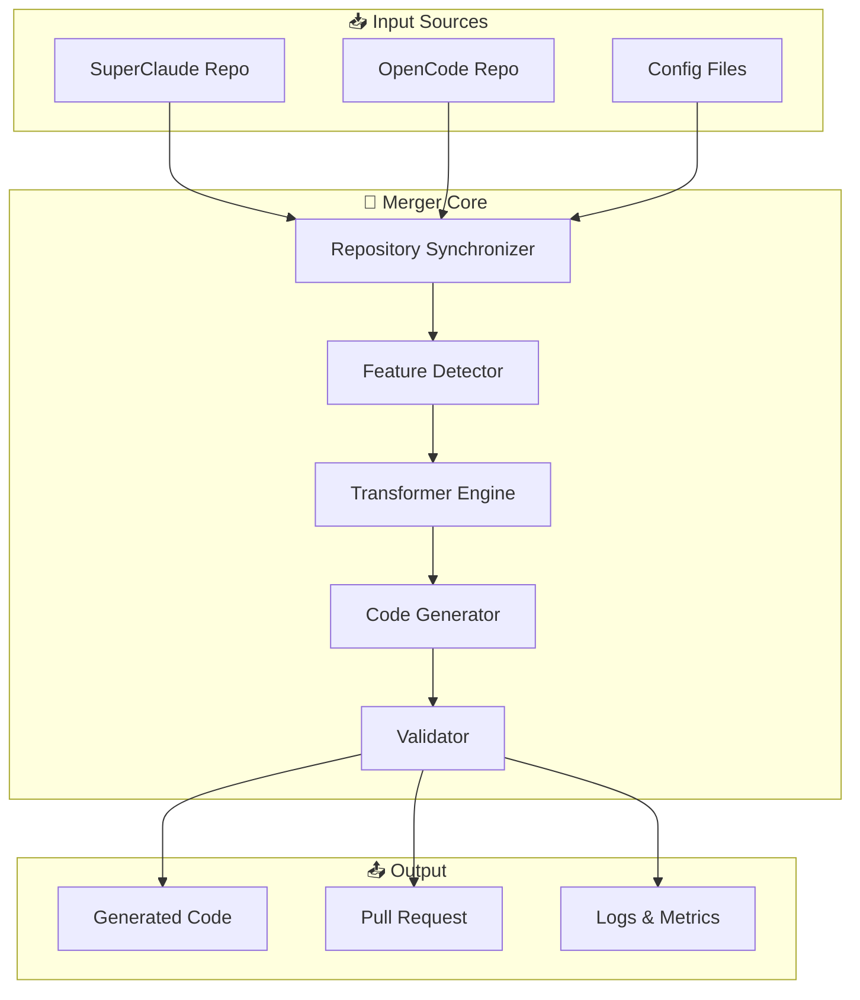

# SuperCode Merger Architecture

[← Back to README](README.md) | [Implementation Details →](implementation-details.md)

---

## 🏗️ System Architecture Overview



## 📁 Project Structure

```
SuperCode/
├── cmd/
│   └── supercode/
│       └── main.go              # CLI entry point
├── merger/
│   ├── analyzer/                # Feature detection
│   │   ├── detector.go         # Base detector interface
│   │   ├── personas.go         # Persona detector
│   │   ├── commands.go         # Command detector
│   │   ├── compression.go      # Compression detector
│   │   └── mcp.go             # MCP server detector
│   ├── generator/              # Code generation
│   │   ├── generator.go        # Base generator interface
│   │   ├── go_generator.go     # Go code generator
│   │   ├── config_generator.go # Config file generator
│   │   └── template_engine.go  # Template processing
│   ├── transformer/            # Data transformation
│   │   ├── transformer.go      # Base transformer
│   │   ├── yaml_to_go.go      # YAML → Go transformer
│   │   ├── md_to_cmd.go       # Markdown → Command
│   │   └── rules_engine.go    # Transformation rules
│   ├── validator/              # Validation & testing
│   │   ├── validator.go        # Base validator
│   │   ├── syntax_validator.go # Syntax checking
│   │   ├── test_runner.go     # Test execution
│   │   └── metrics.go         # Performance metrics
│   └── pipeline/               # Orchestration
│       ├── pipeline.go         # Main pipeline
│       ├── stages.go          # Pipeline stages
│       ├── scheduler.go       # Automation scheduler
│       └── reporter.go        # Status reporting
├── internal/
│   ├── config/                 # Configuration
│   │   ├── loader.go          # Config loader
│   │   └── schema.go          # Config schema
│   ├── git/                    # Git operations
│   │   ├── client.go          # Git client
│   │   └── webhooks.go        # Webhook handlers
│   ├── github/                 # GitHub integration
│   │   ├── client.go          # GitHub API client
│   │   └── pr.go             # PR management
│   └── cache/                  # Caching system
│       ├── cache.go           # Cache interface
│       └── file_cache.go      # File-based cache
├── templates/                  # Code generation templates
│   ├── persona.go.tmpl
│   ├── command.md.tmpl
│   ├── mcp_server.go.tmpl
│   └── config.json.tmpl
├── configs/                    # Default configurations
│   ├── mappings.yaml          # Feature mappings
│   ├── rules.yaml             # Transformation rules
│   └── defaults.toml          # Default settings
└── tests/                      # Test suites
    ├── integration/
    ├── e2e/
    └── fixtures/
```

## 🔍 Core Components

### 1. Repository Downloader (Already Implemented)

```go
// internal/downloader/downloader.go
type Downloader struct {
    SuperClaudeRepo string
    OpenCodeRepo    string
    TargetDir       string
    verbose         bool
}

func (d *Downloader) DownloadAll() error {
    // Downloads both repositories with go-git
    // Supports both clone and update operations
    // Uses shallow clone for efficiency
}
```

### 2. Feature Detector (To Be Implemented)

Based on analysis, key detection targets:

**SuperClaude Features to Detect:**
- 9 Personas in `shared/superclaude-personas.yml`
- 18 Commands in `commands/*.md`
- Universal flags in YAML files
- @include directives throughout
- MCP configurations

**OpenCode Integration Points:**
- TypeScript command structure in `packages/opencode/src/cli/cmd/`
- MCP server configs in `opencode.json`
- Tool definitions in `packages/opencode/src/tool/`
- Provider system in `packages/opencode/src/provider/`

```go
// internal/analyzer/detector.go
type FeatureDetector struct {
    personaDetector   *PersonaDetector
    commandDetector   *CommandDetector
    mxpDetector      *MCPDetector
    compressionDetector *CompressionDetector
}

// Specific detector for SuperClaude personas
func (d *PersonaDetector) Detect(repoPath string) ([]Persona, error) {
    // Parse shared/superclaude-personas.yml
    // Extract 9 personas with their configurations
    // Return structured persona data
}
```

### 3. Transformer Engine

Transforms SuperClaude YAML/Markdown → OpenCode TypeScript/JSON

```go
// internal/transformer/transformer.go
type TransformationEngine struct {
    personaTransformer   *PersonaToProviderTransformer
    commandTransformer   *SlashToYargsTransformer
    mcpTransformer      *YAMLToMCPConfigTransformer
    flagTransformer     *UniversalFlagTransformer
}

// Example: Transform SuperClaude persona to OpenCode provider
func (t *PersonaToProviderTransformer) Transform(persona Persona) (*ProviderConfig, error) {
    return &ProviderConfig{
        Name:         fmt.Sprintf("persona-%s", persona.Name),
        SystemPrompt: t.adaptSystemPrompt(persona.SystemPrompt),
        Model:        t.mapModel(persona.Model),
        Temperature:  persona.Temperature,
        Tools:        t.mapTools(persona.Tools),
        TypeScript:   t.generateTypeScriptWrapper(persona),
    }, nil
}

// Example: Transform slash command to Yargs command
func (t *SlashToYargsTransformer) Transform(cmd Command) (*YargsCommand, error) {
    return &YargsCommand{
        Name:        fmt.Sprintf("sc-%s", cmd.Name),
        Description: cmd.Purpose,
        Flags:       t.convertFlags(cmd.Flags),
        Handler:     t.generateHandler(cmd.Implementation),
    }, nil
}
```

### 4. Code Generator

Generates OpenCode-compatible TypeScript/JSON from transformed data

```go
// internal/generator/generator.go
type CodeGenerator struct {
    tsGenerator   *TypeScriptGenerator
    jsonGenerator *JSONConfigGenerator
    mcpGenerator  *MCPServerGenerator
    templates     *template.Template
}

// Generate TypeScript command file for OpenCode
func (g *TypeScriptGenerator) GenerateCommand(cmd YargsCommand) (*GeneratedFile, error) {
    tmpl := g.templates.Lookup("command.ts.tmpl")
    
    var buf bytes.Buffer
    err := tmpl.Execute(&buf, map[string]interface{}{
        "Name":        cmd.Name,
        "Description": cmd.Description,
        "Flags":       cmd.Flags,
        "Handler":     cmd.Handler,
        "Imports":     g.generateImports(cmd),
    })
    
    return &GeneratedFile{
        Path:    fmt.Sprintf("packages/opencode/src/cli/cmd/%s.ts", cmd.Name),
        Content: buf.String(),
        Type:    "typescript",
    }, err
}

// Generate MCP server configuration
func (g *MCPServerGenerator) GenerateConfig(servers []MCPServer) (*GeneratedFile, error) {
    config := map[string]interface{}{
        "mcp": make(map[string]interface{}),
    }
    
    for _, server := range servers {
        config["mcp"].(map[string]interface{})[server.Name] = map[string]interface{}{
            "type":    "local",
            "command": []string{"opencode", "mcp", server.Name},
            "env":     server.Environment,
        }
    }
    
    content, _ := json.MarshalIndent(config, "", "  ")
    return &GeneratedFile{
        Path:    "opencode.json",
        Content: string(content),
        Type:    "json",
    }, nil
}
```

### 5. Validation System

```go
// merger/validator/validator.go
type Validator struct {
    syntaxChecker   *SyntaxChecker
    testRunner      *TestRunner
    metricCollector *MetricCollector
}

func (v *Validator) Validate(files []*GeneratedFile) (*ValidationResult, error) {
    result := &ValidationResult{}
    
    // Syntax validation
    for _, file := range files {
        if err := v.syntaxChecker.Check(file); err != nil {
            result.AddError(file.Path, err)
        }
    }
    
    // Run tests
    testResults, err := v.testRunner.RunAll()
    if err != nil {
        return nil, err
    }
    result.TestResults = testResults
    
    // Collect metrics
    metrics := v.metricCollector.Collect(files)
    result.Metrics = metrics
    
    return result, nil
}
```

## 🔄 Pipeline Flow

### Stage 1: Detection
```go
func (p *Pipeline) detectStage(ctx context.Context) error {
    // Clone/update repositories
    if err := p.synchronizer.Sync(); err != nil {
        return fmt.Errorf("sync failed: %w", err)
    }
    
    // Detect features
    for _, repo := range p.repositories {
        if err := p.detector.DetectAll(repo); err != nil {
            return fmt.Errorf("detection failed: %w", err)
        }
    }
    
    return nil
}
```

### Stage 2: Transformation
```go
func (p *Pipeline) transformStage(ctx context.Context) error {
    features := p.detector.GetAllFeatures()
    
    for _, feature := range features {
        // Transform feature
        transformed, err := p.transformer.Transform(feature)
        if err != nil {
            log.Printf("Transform failed for %s: %v", feature.Name, err)
            continue
        }
        
        p.transformedData = append(p.transformedData, transformed)
    }
    
    return nil
}
```

### Stage 3: Generation
```go
func (p *Pipeline) generateStage(ctx context.Context) error {
    for _, data := range p.transformedData {
        // Generate code
        files, err := p.generator.Generate(data)
        if err != nil {
            log.Printf("Generation failed: %v", err)
            continue
        }
        
        p.generatedFiles = append(p.generatedFiles, files...)
    }
    
    return nil
}
```

### Stage 4: Integration
```go
func (p *Pipeline) integrationStage(ctx context.Context) error {
    // Create feature branch
    branch := fmt.Sprintf("supercode-update-%s", time.Now().Format("20060102-150405"))
    if err := p.gitClient.CreateBranch(branch); err != nil {
        return err
    }
    
    // Write files
    for _, file := range p.generatedFiles {
        if err := p.gitClient.WriteFile(file.Path, file.Content); err != nil {
            return err
        }
    }
    
    // Commit changes
    if err := p.gitClient.Commit("SuperCode: Automated feature update"); err != nil {
        return err
    }
    
    // Create PR
    pr := &PullRequest{
        Title: "SuperCode: Automated feature update",
        Body:  p.generatePRBody(),
        Base:  "main",
        Head:  branch,
    }
    
    return p.githubClient.CreatePR(pr)
}
```

## 🔌 Extension Points

### Custom Detectors
```go
// Implement the Detector interface
type MyCustomDetector struct{}

func (d *MyCustomDetector) Name() string { return "custom" }
func (d *MyCustomDetector) Priority() int { return 100 }
func (d *MyCustomDetector) Detect(repo *Repository) ([]Feature, error) {
    // Custom detection logic
}

// Register detector
registry.Register(&MyCustomDetector{})
```

### Custom Generators
```go
// Implement the Generator interface
type MyCustomGenerator struct{}

func (g *MyCustomGenerator) Generate(data TransformedData) (*GeneratedFile, error) {
    // Custom generation logic
}

func (g *MyCustomGenerator) ValidateOutput(file *GeneratedFile) error {
    // Custom validation
}
```

## 🎯 Design Principles

1. **Modularity**: Each component is independent and replaceable
2. **Extensibility**: Easy to add new detectors, generators, and transformers
3. **Testability**: All components are interface-based for easy mocking
4. **Observability**: Comprehensive logging and metrics throughout
5. **Fault Tolerance**: Graceful handling of errors with fallback strategies

## 📊 Metrics & Monitoring

```go
type Metrics struct {
    // Detection metrics
    FeaturesDetected   int
    DetectionDuration  time.Duration
    DetectionErrors    int
    
    // Generation metrics
    FilesGenerated     int
    GenerationDuration time.Duration
    GenerationErrors   int
    
    // Validation metrics
    TestsPassed        int
    TestsFailed        int
    SyntaxErrors       int
    
    // Performance metrics
    TokenReduction     float64
    MemoryUsage        int64
    CPUUsage           float64
}
```

## 🚀 Implementation Roadmap Based on Analysis

### Phase 1: Feature Detection (Current)
- [x] Repository Downloader - COMPLETED
- [ ] YAML Parser for SuperClaude configs
- [ ] Command Pattern Detector for slash commands
- [ ] @include Directive Resolver
- [ ] MCP Configuration Extractor

### Phase 2: Transformation Engine
- [ ] Persona → Provider Transformer
- [ ] Slash Command → Yargs Command Transformer
- [ ] YAML Config → JSON Config Transformer
- [ ] Universal Flag Mapper

### Phase 3: Code Generation
- [ ] TypeScript Command Generator
- [ ] MCP Server Wrapper Generator
- [ ] Provider Extension Generator
- [ ] Configuration Merger

### Phase 4: Integration & Validation
- [ ] OpenCode Integration Tests
- [ ] Feature Parity Validation
- [ ] Performance Benchmarking
- [ ] Documentation Generation

## 🎯 Key Technical Decisions

1. **Language Bridge**: Go merger generates TypeScript/JSON for OpenCode
2. **MCP as Primary Integration**: Convert SuperClaude tools to MCP servers
3. **Provider Wrapping**: Personas implemented as custom providers
4. **Command Prefix**: All SuperClaude commands prefixed with `sc-`
5. **Configuration Extension**: Extend rather than replace OpenCode config

## 📊 Code Quality & Technical Debt (2025-07-10)

### Current State Assessment

**Overall Code Quality: 65/100**
- ✅ Good architectural design
- ✅ Clear modular structure
- ❌ Critical import cycle blocking tests
- ❌ Low test coverage (17-38%)
- ⚠️ Missing implementations

### Critical Issues

1. **Import Cycle (Severity: BLOCKER)**
   ```
   generator_test.go → transformer → generator
   ```
   - Prevents compilation of tests
   - Blocks CI/CD pipeline
   - Solution: Extract shared types to `internal/types`

2. **Test Infrastructure (Severity: HIGH)**
   - 17 of 23 tests failing
   - Path mismatches in test data
   - No integration test suite
   - Missing benchmarks

3. **Technical Debt**
   - 764-line functions (MCP detector)
   - Silent error handling in places
   - Basic logging without structure
   - Multiple TODO implementations

### Performance Profile
- **Build Time**: <30s ✅
- **Detection Rate**: 100% ✅
- **Concurrency**: None ❌
- **Caching**: None ❌

### Security Considerations
- No credential leaks ✅
- Proper file permissions ✅
- No input validation ⚠️
- No sandboxing ⚠️

### Recommended Refactoring Priority
1. Fix import cycle (immediate)
2. Repair test suite (1-2 days)
3. Complete missing implementations (1 week)
4. Add structured logging (2 weeks)
5. Optimize performance (1 month)

---

*Updated based on comprehensive repository analysis - 2025-07-09*
*Code quality analysis added - 2025-07-10*