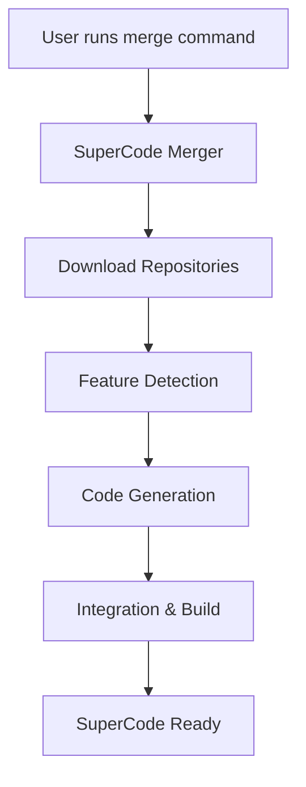

# 🤖 SuperCode Merger Tool - Implementation Roadmap

[← Back to README](README.md) | [Architecture Details →](implementation-details.md)

---

## 📋 Executive Summary

**Projekt**: Merger-Tool für SuperClaude + OpenCode = SuperCode  
**Ziel**: Einmalige, vollständige Integration aller SuperClaude-Features in OpenCode  
**Technologie**: Go-basiertes Merger-Tool mit Feature Detection und Code Generation  
**Ausführung**: Manuell gestarteter Merge-Prozess

## 🎯 System Overview



## 🏗️ Merger Tool Architecture

### Core Components

#### 1. **Repository Downloader** 
```go
// merger/sync/downloader.go
type Downloader struct {
    SuperClaudeRepo string
    OpenCodeRepo    string
    TargetDir       string
}

func (d *Downloader) DownloadAll() error {
    // Clone SuperClaude
    if err := d.cloneRepo(d.SuperClaudeRepo, "superclaude"); err != nil {
        return err
    }
    
    // Clone OpenCode
    if err := d.cloneRepo(d.OpenCodeRepo, "opencode"); err != nil {
        return err
    }
    
    return nil
}
```

#### 2. **Feature Detection Engine**
```go
// merger/analyzer/detector.go
type FeatureDetector struct {
    Patterns     []DetectionPattern
    YAMLParser   *YAMLParser
    MDParser     *MarkdownParser
    Registry     *FeatureRegistry
}
```
- YAML configuration parsing
- Markdown command extraction
- Pattern matching for all features
- Dependency resolution

#### 3. **Code Generation System**
```go
// merger/generator/generator.go
type CodeGenerator struct {
    Templates    map[string]*template.Template
    Transformers map[string]Transformer
    Validator    *CodeValidator
}
```
- Template-based code generation
- AST manipulation for Go code
- Configuration transformers
- Validation and testing

#### 4. **Integration Builder**
```go
// merger/builder/builder.go
type Builder struct {
    SourceDir    string
    OutputDir    string
    BuildConfig  BuildConfig
}
```
- Merge generated code
- Build final binary
- Run validation tests
- Package SuperCode

## 📅 Implementation Phases

### 🟢 Phase 1: Core Tool Development (Week 1-2)
**Goal**: Basic merger functionality

#### Week 1: Foundation
- [ ] Repository downloader module
- [ ] Basic feature detection
- [ ] Configuration parser
- [ ] CLI interface
- [ ] Logging system

```bash
# Usage example
./supercode init
./supercode merge
./supercode build
```

#### Week 2: Feature Detection
- [ ] YAML parser for SuperClaude configs
- [ ] Pattern matching engine
- [ ] Feature registry database
- [ ] Dependency resolver
- [ ] Detection reporting

**Deliverables**:
- Working downloader
- Feature detection for personas and commands
- Basic merge capabilities

### 🟡 Phase 2: Code Generation (Week 3-5)

#### Week 3: Generation Framework
- [ ] Template engine setup
- [ ] Go code generators
- [ ] Configuration transformers
- [ ] Validation framework
- [ ] Test generation

```yaml
# Feature mapping configuration
personas:
  superclaude_path: "personas/*.yml"
  opencode_target: "internal/agents/"
  template: "persona.go.tmpl"
  transformer: "yaml_to_go_config"
```

#### Week 4: Transformation Rules
- [ ] Persona → Agent configuration
- [ ] Commands → Custom commands
- [ ] Compression → Message preprocessor
- [ ] YAML → JSON transformers
- [ ] Import resolution

#### Week 5: Advanced Features
- [ ] MCP server generators
- [ ] Tool integration builders
- [ ] Workflow transformers
- [ ] UI component generators
- [ ] Documentation generators

**Deliverables**:
- Complete code generation system
- All features successfully generated
- Transformation rule library

### 🔴 Phase 3: Integration & Polish (Week 6-8)

#### Week 6: Build System
- [ ] Merge generated code with OpenCode
- [ ] Dependency management
- [ ] Build configuration
- [ ] Binary packaging
- [ ] Installation scripts

#### Week 7: Testing & Validation
- [ ] Comprehensive test suite
- [ ] Feature parity validation
- [ ] Performance benchmarking
- [ ] Security scanning
- [ ] Documentation validation

#### Week 8: Release Preparation
- [ ] Error handling improvements
- [ ] Performance optimization
- [ ] Documentation completion
- [ ] Example configurations
- [ ] Release packaging

**Deliverables**:
- Production-ready merger tool
- Complete SuperCode package
- Comprehensive documentation

## 🔧 Usage Workflow

### Standard Merge Process

```bash
# 1. Initialize SuperCode project
./supercode init

# 2. Configure sources (optional - uses defaults)
./supercode config set superclaude.repo https://github.com/NomenAK/SuperClaude.git
./supercode config set opencode.repo https://github.com/sst/opencode.git

# 3. Run the merge
./supercode merge

# 4. Build SuperCode
./supercode build

# 5. Install and use
./supercode install
supercode --help
```

### Advanced Options

```bash
# Merge specific features only
./supercode merge --features personas,commands

# Use specific versions
./supercode merge --superclaude-tag v1.2.3 --opencode-tag v2.0.0

# Custom output directory
./supercode merge --output ./my-supercode

# Dry run to see what will be done
./supercode merge --dry-run
```

## 📊 Merge Process Details

### 1. Download Phase
```
┌─────────────────────────────────────────┐
│ Downloading repositories...              │
├─────────────────────────────────────────┤
│ ✓ SuperClaude: latest (1.5GB)          │
│ ✓ OpenCode: latest (800MB)             │
│ ✓ Dependencies resolved                 │
└─────────────────────────────────────────┘
```

### 2. Detection Phase
```
┌─────────────────────────────────────────┐
│ Detecting features...                    │
├─────────────────────────────────────────┤
│ ✓ Personas: 9 found                     │
│ ✓ Commands: 18 found                    │
│ ✓ Compression rules: 47 found           │
│ ✓ MCP servers: 3 found                  │
│ ✓ Tools: 6 found                        │
└─────────────────────────────────────────┘
```

### 3. Generation Phase
```
┌─────────────────────────────────────────┐
│ Generating code...                       │
├─────────────────────────────────────────┤
│ ✓ Agent configurations: 9 files         │
│ ✓ Command templates: 18 files           │
│ ✓ Compression engine: 3 files           │
│ ✓ MCP integrations: 6 files             │
│ ✓ Tests: 45 files                       │
└─────────────────────────────────────────┘
```

### 4. Build Phase
```
┌─────────────────────────────────────────┐
│ Building SuperCode...                    │
├─────────────────────────────────────────┤
│ ✓ Merging code: Success                 │
│ ✓ Compiling binary: Success             │
│ ✓ Running tests: 45/45 passed           │
│ ✓ Packaging: supercode-v1.0.0          │
└─────────────────────────────────────────┘
```

## 🚨 Error Handling

### Common Issues

1. **Repository Access**
   ```bash
   # Use SSH if HTTPS fails
   ./supercode config set git.protocol ssh
   ```

2. **Feature Conflicts**
   ```bash
   # Skip conflicting features
   ./supercode merge --skip feature-name
   ```

3. **Build Failures**
   ```bash
   # Verbose mode for debugging
   ./supercode build --verbose
   ```

## 🎯 Next Steps (Updated 2025-07-10)

### Phase 1: Critical Fixes (BLOCKER - 2-4 hours)
1. [x] ~~Set up development environment~~ ✅ COMPLETE
2. [x] ~~Create Go module structure~~ ✅ COMPLETE
3. [x] ~~Implement basic CLI~~ ✅ COMPLETE
4. [ ] **Fix Import Cycle** 🔴 CRITICAL
   - Extract shared types to `internal/types` package
   - Update imports in generator and transformer
   - Verify all packages compile

### Phase 2: Test Infrastructure (HIGH - 4-6 hours)
1. [ ] Fix Persona Detector paths
   - Add `personas/` to search paths
   - Sync testdata structure
2. [ ] Repair failing tests (17/23 currently failing)
3. [ ] Enable CI/CD pipeline
4. [ ] Measure test coverage (target: >50%)

### Phase 3: Feature Completion (MEDIUM - 1-2 days)
1. [ ] Implement `init` command
   - Configuration setup
   - Repository URL configuration
2. [ ] Implement `detect` command
   - Feature analysis output
   - JSON/YAML export option
3. [ ] Complete Compression transformation
4. [ ] Remove all TODO implementations

### Phase 4: Code Quality (MEDIUM - 2-3 days)
1. [ ] Implement structured logging (zerolog)
2. [ ] Unified error handling
3. [ ] Fix silent error ignoring
4. [ ] Add debug mode support

### Phase 5: Integration & Performance (MEDIUM-HIGH - 3-4 days)
1. [ ] Create end-to-end tests
2. [ ] Implement concurrent processing
3. [ ] Add repository caching
4. [ ] Increase test coverage to >80%
5. [ ] Add performance benchmarks

### Development Priorities (Completed ✅)
1. [x] Repository downloader
2. [x] Persona detection and generation
3. [x] Command system integration
4. [x] Testing framework (needs fixes)
5. [x] Documentation

## 📚 Resources

### Technical Documentation
- [Go Templates](https://golang.org/pkg/text/template/)
- [Go AST Package](https://golang.org/pkg/go/ast/)
- [Cobra CLI Framework](https://github.com/spf13/cobra)

### Source Repositories
- [SuperClaude](https://github.com/NomenAK/SuperClaude)
- [OpenCode](https://github.com/sst/opencode)

## 📊 Timeline Overview

| Phase | Duration | Priority | Dependencies |
|-------|----------|----------|--------------|
| Phase 1: Critical Fixes | 2-4 hours | 🔴 CRITICAL | None |
| Phase 2: Test Infrastructure | 4-6 hours | 🟠 HIGH | Phase 1 |
| Phase 3: Feature Completion | 1-2 days | 🟡 MEDIUM | Phase 2 |
| Phase 4: Code Quality | 2-3 days | 🟡 MEDIUM | Phase 2 (partial) |
| Phase 5: Integration & Performance | 3-4 days | 🟠 MEDIUM-HIGH | Phase 3 |

**Total Estimated Time**: 7-10 working days to production readiness

## ✅ Definition of Done

The project is production-ready when:
- All tests pass (100%)
- Test coverage exceeds 80%
- No critical issues remain
- All commands are implemented
- Performance targets are met
- Documentation is current
- CI/CD pipeline is green
- Security checks pass

---

*Last Update: 2025-07-10*  
*Version: 1.1*  
*Status: Functionally Complete, Technical Debt Remediation Required*